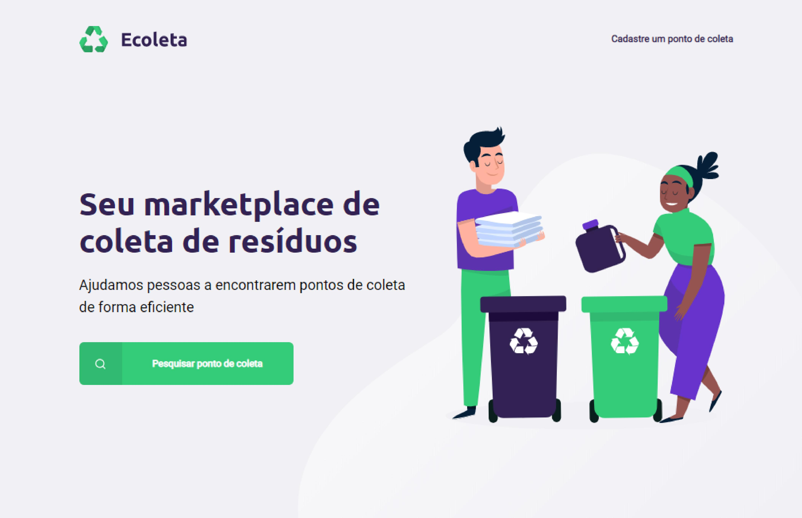
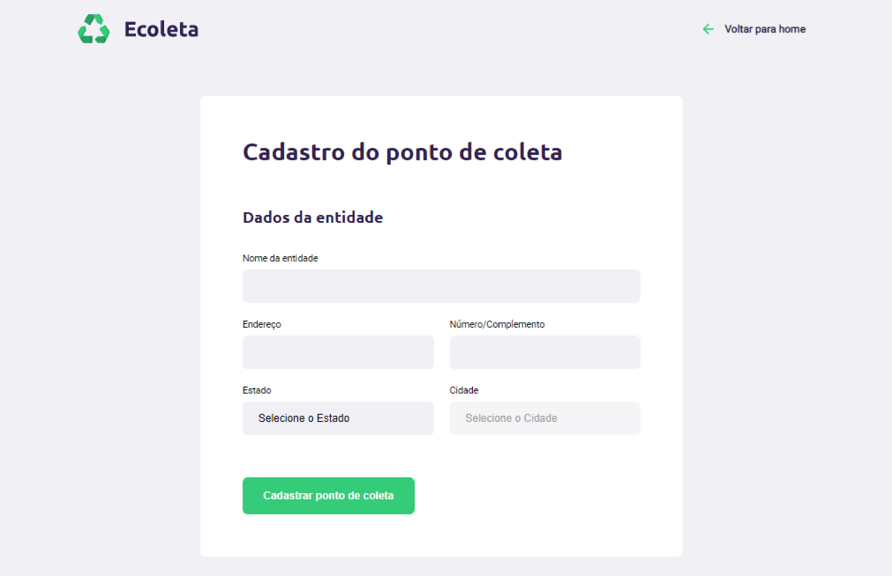
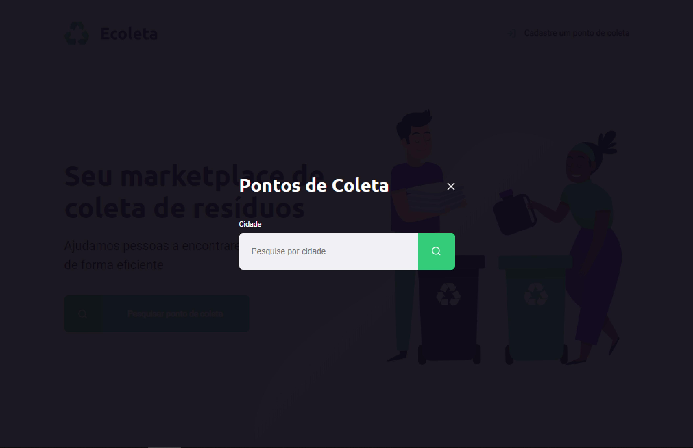
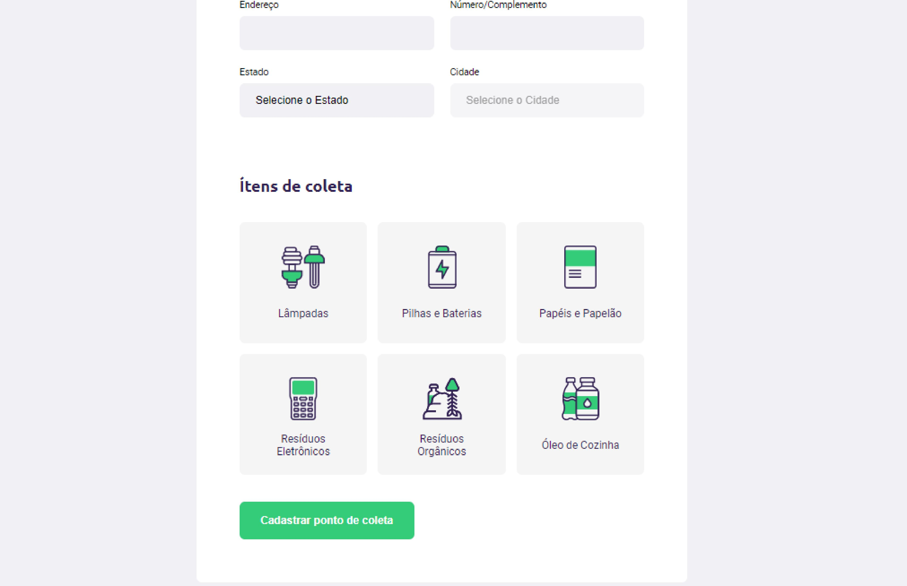
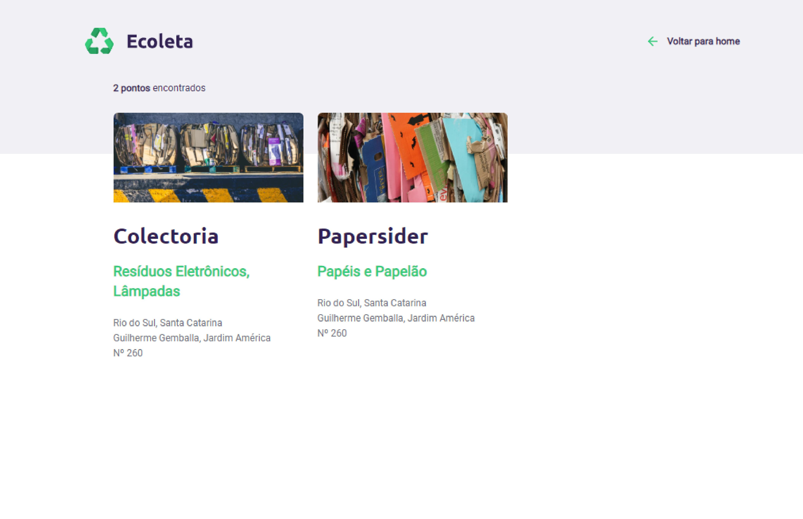

# Next Level Week
A NLW é um workshop feito pela [rocketseat](http://rocketseat.com.br/), que tem como foco levar os programadores ao próximo nível de sua carreira.

Existem duas trilhas existentes nesse projeto, a **Starter**, focada em iniciantes que tiveram pouco ou nenhum contato com programação, e a **Booster**, feita para quem já está em um nível intermediário, e tem bastante experiência com códigos. 

A trilha que eu estou fazendo é a starter, e estarei atualizando o conteúdo do repositório conforme as aulas estão sendo liberadas.

# 
Ecoleta é o projeto que está sendo realizado neste workshop, um marketplace que ajuda a encontrar pontos de coleta de forma eficiente.

- [x] Dia 1
* Introdução ao projeto
* Criação da página inicial
* HTML e CSS
* Introdução a responsividade

- [x] Dia 2
* Introdução ao Javascript
* Página de criar ponto de coleta
* HTML, CSS e JS

- [x] Dia 3
* Correção de bugs
* Att na responsividade dos sites
* Att página inicial e Ponto de coleta

* Criação da página de resultados de pesquisa

- [ ] Dia 4

- [ ] Dia 5

***

<b>
  Bora Codar! :rocket:</b>

