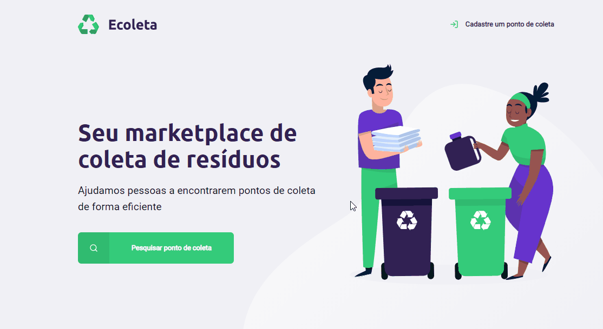
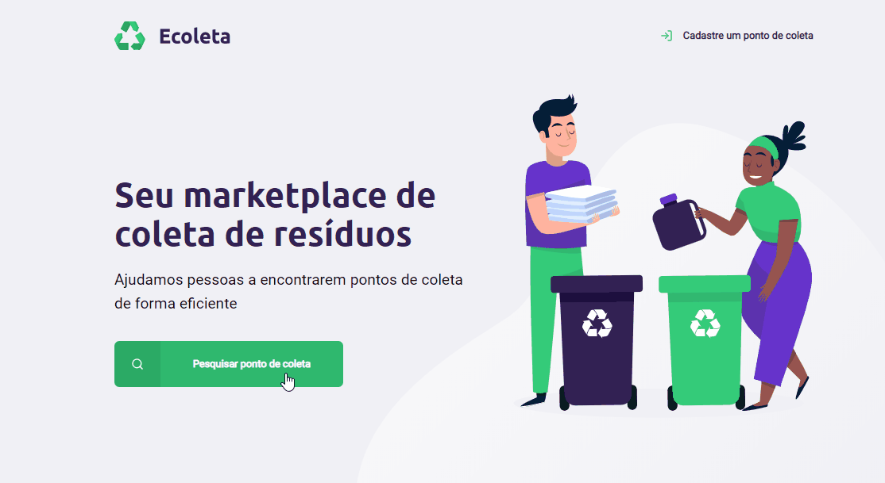

# Next Level Week
A NLW é um workshop feito pela [rocketseat](http://rocketseat.com.br/), que tem como foco levar os programadores ao próximo nível de sua carreira.

Existem duas trilhas existentes nesse projeto, a **Starter**, focada em iniciantes que tiveram pouco ou nenhum contato com programação, e a **Booster**, feita para quem já está em um nível intermediário, e tem bastante experiência com códigos. 

A trilha que eu estou fazendo é a starter, e estarei atualizando o conteúdo do repositório conforme as aulas estão sendo liberadas.

# 
Ecoleta é o projeto que está sendo realizado neste workshop, um marketplace que ajuda a encontrar pontos de coleta de forma eficiente, com um sistema de registro e pesquisa desses pontos, alocados em um banco de dados.

As linguagens utilizadas foram **HTML, CSS, Javascript e SQL.**

# :books: Como Utilizar

- [Baixe ou clone](https://help.github.com/pt/github/creating-cloning-and-archiving-repositories/cloning-a-repository) este repositório

- Abra o cmd, e entre na pasta do repositório

- Digite **npm install**

- Aguarde a instação dos pacotes

- Após a instalação, digite **npm start** 

- Abra no seu navegador a página **localhost:3000/**

- E pronto! :sparkles:
# :camera: Screenshots
### Página inicial:

### Página criar ponto de coleta:

### Página pesquisar ponto de coleta:

# :heavy_check_mark: Progresso

- [x] Dia 1
* Introdução ao projeto
* Criação da página inicial
* HTML e CSS
* Introdução a responsividade

- [x] Dia 2
* Introdução ao Javascript
* Página de criar ponto de coleta
* HTML, CSS e JS

- [x] Dia 3
* Correção de bugs
* Att na responsividade dos sites
* Att página inicial e Ponto de coleta
* Criação da página de resultados de pesquisa

- [x] Dia 4
* Organização das pastas do projeto
* Criação do servidor
* Template engine (nunjucks)

- [x] Dia 5
* Introdução a banco de dados (SQLite)
* Criação de uma database
* Esquema de registro e pesquisa de pontos de coleta completos

***

<b>
  Bora Codar! :rocket:</b>

